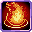

# Fire

<small>[Tensura: Reincarnated](../../index.md) &rsaquo; [Abilities](../index.md) &rsaquo; [Spiritual Magic](index.md)</small>

| | |
|---|---|
| **Type** | Spiritual Magic |
| **ID** | `tensura:fire` |
| **Element** | Fire |
| **Max mastery** | 100 / 500 / 1,000 / 10,000 |
| **Activation** | Hold |

> Use your spirit to start a small fire.

## Costs

| When | Magicule (MP) | Aura (AP) |
|---|---|---|
| Always | 10 |  |

## How it works

- Triggers when the held key is released

## Obtaining

- Removed and re-rolled when you change race

## Stats (config defaults)

Set in [`config/tensura/ability/magic/spiritual_config.toml`](../../configs/config-tensura-ability-magic-spiritual-config.md).

| Option | Default | Description |
|---|---|---|
| `Fire.castTime` | 1 | Cast time in tick. |
| `Fire.castTimeMastered` | 1 | Cast time in tick when mastered. |
| `Fire.magiculeCost` | 10 | Magicule Cost to cast. |
| `Fire.range` | 6 | The range in block of the magic. |

Set in [`config/tensura/ability/magic_config.toml`](../../configs/config-tensura-ability-magic-config.md).

| Option | Default | Description |
|---|---|---|
| `SpiritualMagic.masteryLesser` | 100 | The max amount of mastery point for Lesser Spiritual Magic. |
| `SpiritualMagic.masteryLesser` | 100 | The max amount of mastery point for Lesser Spiritual Magic. |
| `SpiritualMagic.masteryMedium` | 500 | The max amount of mastery point for Medium Spiritual Magic. |
| `SpiritualMagic.masteryGreater` | 1,000 | The max amount of mastery point for Greater Spiritual Magic. |
| `SpiritualMagic.masteryLord` | 10,000 | The max amount of mastery point for Lord Spiritual Magic. |

## Tags

`tensura:skills/reset_with_race`, `tensura:skills/spiritual_magic`
