# Spiritual Magic

<small>[Tensura: Reincarnated](../../index.md) &rsaquo; [Abilities](../index.md)</small>

Magic borrowed from spirits and elementals.

| | Ability | Description |
|---|---|---|
| 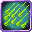 | [Acid Rain](acid-rain.md) | Summon an acidic cloud which will corrode any afflicted entities. |
|  | [Aerial Blade](aerial-blade.md) | Pull in any nearby entities before dealing massive damage by unleashing the power of your spirit. |
| 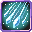 | [Blizzard](blizzard.md) | Creates a powerful storm of ice to slow your enemies and turn the tides of battle. |
|  | [Create Greater Undead](create-greater-undead.md) | Call forth armed undead from the ground to aid the caster. |
|  | [Create Lesser Undead](create-lesser-undead.md) | Call forth weak undead from the ground to aid the caster. |
|  | [Curse](curse.md) | Release Miasmic Mist to curse targets. |
| 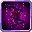 | [Curse Bind](curse-bind.md) | Call forth spirits of the death to bind and corrode targets. |
|  | [Dark Cube](dark-cube.md) | Create a cube of darkness that slows movement and deals constant damage. |
|  | [Darkness](darkness.md) | Call on your spirit to reduce the enemy's vision in a wide area. |
|  | [Darkness Cannon](darkness-cannon.md) | Shoot a long beam which deals massive damage, destroys armor and debilitates enemies. |
| 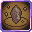 | [Earth](earth.md) | Place down blocks which mimic those from the surrounding environment. |
|  | [Earth Jail](earth-jail.md) | Restrict and weaken a single target, applying debuffs to allow you to finish them off. |
| 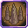 | [Earth Spikes](earth-spikes.md) | Raises earth spikes from the ground to pierce through your enemies. |
| 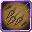 | [Earth Storm](earth-storm.md) | Summons a viscous sandstorm and falling rocks around you. |
|  | [Electro Blast](electro-blast.md) | Fire a beam attack that pierces through enemies and deals devastating damage while paralyzing your enemies. |
|  | [Fire](fire.md) | Use your spirit to start a small fire. |
|  | [Fire Bolt](fire-bolt.md) | Shoots a flaming bolt. |
| 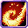 | [Fire Breath](fire-breath.md) | Breathe flames and incinerate your enemies. |
|  | [Flare Circle](flare-circle.md) | Opens a Gate to Hell from which wicked flames erupt to turn your enemies to ash. |
|  | [Gate](gate.md) | Tear space asunder connecting two points in space. |
|  | [Hellfire](hellfire.md) | Summon a sphere of hellfire to deal massive damage in a small area. |
|  | [Light](light.md) | Summons a temporary light to block out the darkness. |
| 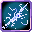 | [Lightning Lance](lightning-lance.md) | Launch a lighting projectile which will electrify your enemies. |
| 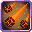 | [Magma Surge](magma-surge.md) | Fire a spread of lava that burns and melts anything for a limited time. |
|  | [Megiddo](megiddo.md) | Unleash powerful sun blasts using water to kill any nearby foes. It can also be used manually to concentrate fire for any stronger foes. |
|  | [Shadow Bind](shadow-bind.md) | If the target is standing in shadows, bind them and deal spiritual damage. |
|  | [Shrink](shrink.md) | Reduce your size to enhance your evasion but increase your vulnerability |
|  | [Solar Beam](solar-beam.md) | Fire a light beam that deals massive damage to undead entities and burns blocks. |
|  | [Solar Flare](solar-flare.md) | Shoot a shockwave of light energy to give nausea, blindness and slowness to all targets in a wide AOE. |
| 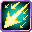 | [Solar Rain](solar-rain.md) | Shoot many light projectiles that deal massive damage to undead creatures. |
|  | [Solar Wave](solar-wave.md) | Shoot a wave of light energy that blinds and slows hit enemies. |
|  | [Space](space.md) | Form invisible platforms to create footholds midair. |
| 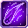 | [Swipe](swipe.md) | Slashing through space in a straight line, displacing entities or teleporting the caster. |
|  | [Teleport](teleport.md) | Quickly blink forward in space to a location within view. |
|  | [True Darkness](true-darkness.md) | Inflict Blindness on all entities and deal massive spiritual damage. |
|  | [Water](water.md) | Call forth or manipulate small amounts of water. |
|  | [Water Cutter](water-cutter.md) | Fires a concentrated blade to cut your enemies with the power of water. |
|  | [Wind](wind.md) | Call forth a small gust of wind which can push targets away or the player up. |
|  | [Wind Blade](wind-blade.md) | Fires a concentrated blade of wind which has heavy knockback. |
