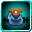

# Commander

<small>[Tensura: Reincarnated](../../index.md) &rsaquo; [Abilities](../index.md) &rsaquo; [Unique Skills](index.md)</small>

| | |
|---|---|
| **Type** | Unique Skill |
| **ID** | `tensura:commander` |
| **Modes** | 3 |
| **Acquisition cost (MP)** | 30,000 |
| **Activation** | Toggle, Press |

> Lead the charge with your allies. Empower yourself and your allies to give yourself an overwhelming advantage.

## Modes

| # | Mode |
|---|---|
| 1 | Communication: Movement |
| 2 | Communication: Targeting |
| 3 | Thought Domination |

## How it works

- Can be toggled on and off
- Activated by pressing the skill key
- Has a continuous (per-tick) effect

### Attribute changes

| Attribute | Amount | Operation |
|---|---|---|
| degrade | 1 | add |
| melee | 10 | add |
| projectile | 10 | add |
| negate | 50 | add |

## Obtaining

- Listed in the `startingSkills` config option (config/tensura/reincarnation_config.toml): List of Unique skills that can be randomly obtained through reincarnation.
- Listed in the `secondSkills` config option (config/tensura/reincarnation_config.toml): List of Unique skills that can be randomly obtained through reincarnation as a second Unique - Only applies when the Skill Number on...
- Listed in the `uniqueSkills` config option (config/tensura/ability/skill/unique_config.toml): List of Unique skills that can be created by Creator.

## Related

- **Effects:** [Inspiration](../../effects/inspiration.md)
- **Summons / entities:** Tensura
- **Referenced by:** [Alteration](../../../tr-nightmares/abilities/extra-skills/alteration.md), [｢ Amaterasu, Lord of Shimmering Flames ｣](../../../tr-nightmares/abilities/ultimate-skills/amaterasu.md)

## Stats (config defaults)

Set in [`config/tensura/ability/skill/unique_config.toml`](../../configs/config-tensura-ability-skill-unique-config.md).

| Option | Default | Description |
|---|---|---|
| `Commander.mpAcquirement` | 30,000 | Magicule Acquirement Cost. |
| `Commander.chantSpeed` | 2 | The chant speed multiplier when toggled. |
| `Commander.meleeDodge` | 10 | Melee Dodge Chance when toggled. |
| `Commander.projectileDodge` | 10 | Projectile Dodge Chance when toggled. |
| `Commander.dodgeNegation` | 50 | Dodge Negation Chance when toggled. |
| `Commander.inspireRadius` | 30 | The radius in block for Inspire Force's effect on allies. |
| `Commander.inspireMultiplier` | 0.3 | The multiplier of boost on each physical stats of allies when applied with Inspire Force (doubled with mastery). |
| `Commander.inspireCritChance` | 30 | The Critical Attack Chance for allies when applied with Inspire Force (doubled with mastery). |

## Tags

`tensura:skills/unique_skills`
