# Unique Skills

<small>[Tensura: Reincarnated](../../index.md) &rsaquo; [Abilities](../index.md)</small>

Personal skills that shape a character. You usually start with one and can gain more through feats.

| | Ability | Description |
|---|---|---|
|  | [Absolute Severance](absolute-severance.md) | Wield the power to cut through any who stand in your path, whether by coating your strikes or launching slashing projectiles that sever all in their path. |
|  | [Analyst](analyst.md) | Enhance cognitive processing, analyze targets and phenomena, accelerate magic casting and deepen understanding of the laws of the world to optimize all actions. |
|  | [Anti-Skill](anti-skill.md) | Become immune to damage from Magic, Skills and Battlewill, destroy barriers and block skill usage of other entities. |
|  | [Berserk](berserk.md) | Massively empower your body and infuse it with a flame aura. Allows you to go into a risky but overwhelmingly powerful berserker mode. |
| 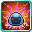 | [Berserker](berserker.md) | Feed on your enemies' defeat. Gain EP from kills, destroy equipment faster, and boost your physical stats based on your power level. |
|  | [Bewilder](bewilder.md) | Manipulate friends and foes, compelling them to act according to your will. |
|  | [Chef](chef.md) | Purify and renew. Remove all negative effects and restore vitality to those under your care. |
|  | [Chosen One](chosen-one.md) | Radiate authority and charisma to force fear into the hearts of your enemies and to make them follow you instead, while empowering yourself and your allies. |
|  | [Commander](commander.md) | Lead the charge with your allies. Empower yourself and your allies to give yourself an overwhelming advantage. |
| 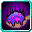 | [Cook](cook.md) | Bend reality to ensure your enemies meet their demise by ignoring their dodge and barriers. |
| 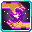 | [Creator](creator.md) | Create any Unique Skill and use it for a limited amount of time. |
| 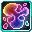 | [Degenerate](degenerate.md) | Craft, decraft, customize items and absorb strength from weakened enemies. |
|  | [Divine Berserker](divine-berserker.md) | Empower your body by a massive amount but beware the aftereffects. |
|  | [Engorger](engorger.md) | Increase your size and boost your physical stats. |
| 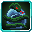 | [Envy](envy.md) | Absorb strength from enemies, buff yourself and debilitate your enemies. |
|  | [Falsifier](falsifier.md) | See through falsehoods and invisibility, conceal your presence from prying eyes and create illusions. |
|  | [Fighter](fighter.md) | Achieve mastery through discipline. Learn combat and magic abilities instantly, gain more mastery points, and hit much harder. |
| 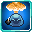 | [Fusionist](fusionist.md) | Turn the world into a weapon, absorb the environment to create powerful mines and grenades. |
| 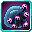 | [Gluttony](gluttony.md) | Absorb all in your path. None can win. Receive and provide skills, gain access to a spatial storage and mimic entities. |
|  | [Godly Craftsman](godly-craftsman.md) | Utilize your years of experience to create masterpieces with ease and engrave your weapons for terrifying efficiency. |
| 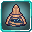 | [Gourmand](gourmand.md) | Feast on the energy of your opponents. Steal magicule with your attacks and become more powerful when killing others. |
| 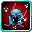 | [Gourmet](gourmet.md) | Absorb your enemies, gain new powers, and break down anything that stands in your way. |
| 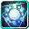 | [Great Sage](great-sage.md) | Improve your cognitive skills to learn and cast faster, become able to appraise targets and use analysis to copy skills and process materials to craft or... |
|  | [Greed](greed.md) | Take everything. Conquer the world and your enemies with it. Kill anyone who stands in your path while strengthening yourself or your allies. |
|  | [Guardian](guardian.md) | Stand as a bastion against the force of your enemies. Absorb the damage from your allies and fortify their defenses. |
| 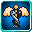 | [Healer](healer.md) | Mend wounds with a touch or unleash devastating afflictions, capable of both salvation and suffering. |
|  | [Infinity Prison](infinity-prison.md) | Trap enemies in an unbreakable dimensional cage or shield yourself from any threat with your dimensional barrier. Gain access to spatial storage. |
|  | [Lust](lust.md) | Assert your control over life and death. Drain your enemies of their strength or invigorate those under your wing. |
|  | [Martial Master](martial-master.md) | Empower your physical attacks, accelerate your thought process to react and dodge better while beating your enemies to submission. |
| 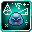 | [Mathematician](mathematician.md) | Use mathematics to improve your combat abilities, become able to use analytical appraisal to assess all. |
|  | [Merciless](merciless.md) | Instantly kill weakened enemies or drain the life force of those who lack the will to fight or of those much weaker than you. |
| 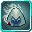 | [Murderer](murderer.md) | Disappear into the shadows and deal massive damage, also become undetectable by sound. |
|  | [Musician](musician.md) | Turn beautiful music into an instrument of destruction. Use sound to create powerful blasts which ignore armor. |
|  | [Observer](observer.md) | See all, evade all. Instinctively avoid attacks, detect concealed dangers, and identify hidden entities. Nothing escapes your watchful gaze. |
|  | [Oppressor](oppressor.md) | Dominate gravity yourself, control attractive and repulsive forces or unleash devastating ranged attacks which will crush anyone unfortunate enough to be in... |
|  | [Predator](predator.md) | Become the monster you were meant to be. Eat all. Analyze, craft and refine items, gain access to a spatial storage and mimic entities. |
|  | [Pride](pride.md) | Turn the strength of your opponents into your own and turn the tides of battle. Copy abilities when you are struck by them, provided you meet the necessary... |
|  | [Reaper](reaper.md) | Do recon by becoming smaller and more agile while seeing all enemies nearby. Spawn clones, or consume the essence of your enemies to obliterate them in a... |
|  | [Reflector](reflector.md) | Turn back the tides of battle by reflecting all of the received damage. Unleash a devastating projectile attack or counter an attack directly. |
| 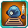 | [Researcher](researcher.md) | Study ancient magic tomes, reverse engineer them, and create wonders beyond imagination. |
|  | [Reverser](reverser.md) | Flip the rules. Change alignments, invert buffs and debuffs while shifting strengths and weaknesses to your benefit. |
|  | [Royal Beast](royal-beast.md) | Unleash a primal fury and gain a massive physical boost to crush your enemies. |
|  | [Seeker](seeker.md) | Accelerate thought processing to extreme levels, mastery over magics and manipulate the fundamental laws governing the world to optimize actions and outcomes. |
|  | [Seer](seer.md) | See everything. Foresee your opponent’s moves. Dodge or mitigate their attacks and predict their movement to score critical strikes. |
| 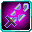 | [Severer](severer.md) | Slice through reality and manifest spatial blades which cut through armor and unleash devastating blade storms. |
|  | [Shadow Striker](shadow-striker.md) | Become one with the shadows and deal massive spiritual damage and become immune to lesser presence detection. |
| 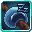 | [Sloth](sloth.md) | Grind the world to a halt. Put your enemies into a deadly sleep, drain their power and rest to regain any lost vitality. May lethargy take over. |
|  | [Sniper](sniper.md) | Deal damage from afar while using different bullets to get past resistances and ensure a quick kill. |
|  | [Spearhead](spearhead.md) | Empower and command your allies, and then collect their abilities once they pass on. |
|  | [Starved](starved.md) | Consume all in your path or have your rampaging subordinates do it. Corrode your enemies, devour their strength, and adding their abilities to your own. |
|  | [Suppressor](suppressor.md) | Restrict teleportation, confuse enemies by swapping places, and use your blink as well as the spatial gate to cross large distances. |
|  | [Survivor](survivor.md) | Endure and outheal anything, resist physical and natural damage and withstand overwhelming odds. |
|  | [Thrower](thrower.md) | Use your skill and your precision to throw anything and deal massive damage. You can even shove air or push back your foes. |
|  | [Traveler](traveler.md) | Move freely through space, teleport large distances or create spatial gates. Manipulate stardust to immense damage. |
| 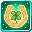 | [Tuner](tuner.md) | Change your fate survive fatal blows, regenerate instantly and manipulate probability. |
|  | [Unyielding](unyielding.md) | Draw power from loyal allies. Fortify subordinates and seamlessly switch to a backup body to stay in the fight. |
|  | [Usurper](usurper.md) | Seize your enemies' power or their summons. Steal their abilities and take control of their skills, draining their strength for your own. |
|  | [Villain](villain.md) | Embody malice and fight on the side of evil. Gain increased power from killing your foes, manipulate your enemies into joining your side and empower your... |
| 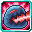 | [Wrath](wrath.md) | Unleash pure rage and use it to get infinitely stronger the longer your anger persists. Beware of the devastating drawback. |
