# Advancements

<small>[Tensura: Reincarnated](../index.md)</small>

Tensura: Reincarnated has **97** advancements.

## Main

| | Advancement | Description | Type |
|---|---|---|---|
| 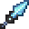 | **Isn't it a bit cold?** | Craft a Ice Blade. | Challenge |
| 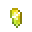 | **Such a Hazard!** | Get 10000 EP and reach A Class. | Goal |
|  | **Acquire Silverware** | Smelt or find a Silver Ingot. | Task |
|  | **Biological Steel?** | Acquire an Adamantite item! | Challenge (hidden) |
| 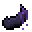 | **Arachnophobic** | Slay a Black Spider. | Task (hidden) |
|  | **I'm a Bsian** | Get 6000 EP and reach B Class. | Task |
| 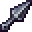 | **Become a real ninja!** | Craft a Kunai. | Goal |
|  | **I believe I can fly** | Obtain Winged Shoes. | Goal |
|  | **The best smelter!** | Craft a Orichalcum Kiln. | Challenge (hidden) |
|  | **The better smelter!** | Craft a Kiln. | Task |
|  | **Blessed One!** | Have a Greater Spirit or above in every elemental. | Challenge (hidden) |
| 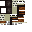 | **Booked on Magic** | Obtain a Magic Grimoire. | Challenge (hidden) |
| 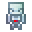 | **Build a Body** | Obtain a Bone Golem. | Goal (hidden) |
|  | **You can't C me** | Get 3000 EP and reach C Class. | Task |
| 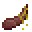 | **Choo Choo!** | Ride an Evil Centipede or Tempest Serpent. | Goal (hidden) |
|  | **Conqueror of Flames** | Defeat a natural Ifrit. | Challenge (hidden) |
|  | **Just average Human** | Get 1000 EP and reach D Class. | Task |
| 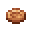 | **It's a deal-ightful trade!** | Complete a trade and obtain coins. | Task |
|  | **Eat or be eaten** | Defeat an Orc Disaster. | Challenge (hidden) |
|  | **Elementalist** | Form a contract with any Spirit. | Goal |
|  | **Empowerment** | Kill a monster to increase your Existence Point (EP) for the first time. | Task |
|  | **The even better smelter!** | Craft a Mithril Kiln. | Goal (hidden) |
|  | **Explosions, explosions, la la la!** | Cast a max-level Explosion for the first time! | Challenge (hidden) |
| 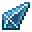 | **Fast Learner** | Learn an ability. | Task |
|  | **The Forbidden Manual!** | Use a Battlewill Manual. | Goal |
|  | **Get bucketed!** | Pick up a slime with a bucket. | Task |
|  | **Getcha Better Leathers!** | Obtain a monster Leather. | Task |
|  | **Getcha Leathers!** | Obtain a vanilla Leather. | Task |
|  | **Gold Rush** | Smelt or find a Gold Ingot. | Task |
| 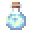 | **As good as new!** | Consume a Full Potion. | Goal (hidden) |
|  | **Who's a good boy?** | Ride a Tempest Star Wolf. | Challenge (hidden) |
|  | **Goodnight Spider** | Slay a Knight Spider and obtain its Carapace. | Task (hidden) |
|  | **The Great Saint of the West** | Defeat Hinata Sakaguchi. | Challenge (hidden) |
|  | **Thrive, my child!** | Feed a Slime core to a tamed Slime to grow its size. | Goal (hidden) |
| 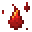 | **Growth Spurt** | Evolve your race once. | Goal |
|  | **Hear me Direwolves!** | Tame a direwolf. | Goal |
|  | **Welcome to the Underworld!** | Enter Hell Dimension. | Goal |
|  | **Hella Cool!** | Have a Daemon mob as subordinate. | Goal |
|  | **The Hero King of the Dwarves** | Defeat Gazel Dwargo. | Challenge (hidden) |
|  | **Don't get too High!** | Mix some Iron with Magic Ore in a Kiln and acquire a High Magisteel Ingot! | Task |
|  | **The higher form of Existence!** | Awaken as a Demon Lord or Chosen Hero. | Challenge (hidden) |
|  | **The Ultimate Metal!** | Acquire an Hihiirokane item! | Challenge (hidden) |
|  | **Hipokute makes me hiccup-te** | Obtain a Hipokute Flower. | Goal |
|  | **Hiss-tory** | Slay a Tempest Serpent and obtain its Scales. | Task (hidden) |
|  | **Infamy and Famous** | Achieve Mass Naming by finishing raids or killing human mobs without dying. | Challenge (hidden) |
|  | **Infinity Cores!** | Use a weapon that has 3 Elemental cores slotted. | Challenge (hidden) |
| 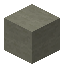 | **Chill! It's just a test!** | Fight the Elemental Colossus and "die". | Task (hidden) |
|  | **Killer fish from Sissiego** | Ride a Sissie. | Goal (hidden) |
|  | **The King has arrived!** | Get your own Supermassive Slime by growing a slime. | Challenge (hidden) |
| 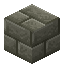 | **Dungeon Encroachment** | Enter the Labyrinth. | Goal (hidden) |
| 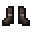 | **Light as a Horned Rabbit** | Walk on powdered snow without sinking, using boots made of monster leathers! | Goal (hidden) |
|  | **Feeling Low?** | Mix some Iron with Magic Ore in a Kiln and acquire a Low Magisteel Ingot! | Task |
|  | **Ore! But Magic?!** | Mine a Magic Ore. | Goal |
|  | **A Magic Seedy Place** | Grow a Hipokute Seed. | Task |
|  | **Master what you learnt!** | Master an ability. | Goal |
|  | **The Master Smith!** | Obtain every smithing schematic. | Challenge (hidden) |
|  | **Master of one trade!** | Master a Unique Skill. | Challenge |
| 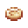 | **That's over 1 million dollar!** | Obtain a Stellar Gold coin. | Goal (hidden) |
|  | **Isn't this just Silver but Magic?** | Mix some Silver with a bit of Magic Ore in a Kiln and acquire a Mithril Ingot! | Goal |
| 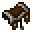 | **Monster Rider** | Craft a Monster Saddle. | Task |
|  | **Monster Tamer** | Tame any monster in any way. | Task |
|  | **A Monstrous Diet** | Eat everything that is edible in Tensura: Reincarnated, even if it's dangerous for you. | Challenge (hidden) |
|  | **My Precious** | Obtain your first Gold coin. | Goal |
|  | **From now on, your name is...** | Name a mob. | Goal |
|  | **Nanoda!!!** | Obtain the Nanoda disk by having a Charybdis kill an Orc Disaster. | Challenge (hidden) |
|  | **This is my no no square** | Use a Magic Engine to block monster spawn in an area. | Goal |
|  | **Why..?** | Own and use a Hihi'Irokane Hoe. | Challenge (hidden) |
|  | **Divine Shining Gold!** | Mix some Gold with a bit of Magic Ore in a Kiln and acquire an Orichalcum Ingot! | Goal |
|  | **Otherworldly Biomes** | Explore all Overworld biomes added by Tensura: Reincarnated. | Challenge (hidden) |
|  | **A Clown Troupe!** | Craft a Pierrot Mask. | Goal |
|  | **That's the quality!** | Acquire a Pure Magisteel Ingot! | Challenge |
|  | **Rainbow in Hell** | Have an Arch Daemon subordinate of each linage. | Challenge (hidden) |
| 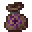 | **Real Adventures** | The real adventure begins! | Goal |
|  | **TenSura** | Reincarnation... Successful. | Goal |
|  | **It's rewind time!** | Use a reset scroll. | Challenge (hidden) |
| 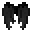 | **Ripoff Elytra, good enough?** | Obtain a Bat Glider. | Goal |
|  | **Ruler of Monsters** | Make a subordinate of each of these races: Direwolf, Goblin, Lizardman, Orc and Slime. | Challenge (hidden) |
| 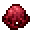 | **Ruler of the Skies** | Defeat a Charybdis. | Challenge (hidden) |
| 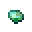 | **Walking Disaster!** | Get 400000 EP and reach S Class. | Challenge (hidden) |
|  | **Calamity Monsters!** | Get 100000 EP and reach Special-A Class. | Goal |
|  | **Shell Lizard** | Slay an Armorsaurus and obtain its Scales and Shell. | Task (hidden) |
| 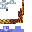 | **100 slimes vs 1 Gorilla?** | Use a Slime Staff to summon slimes. | Challenge (hidden) |
|  | **Traitor!** | Consume a slime in a bucket with skills. | Challenge (hidden) |
|  | **The fairy wont like this...** | Defeat the Elemental Colossus. | Challenge (hidden) |
|  | **Literal Catastrophe!** | Get 800000 EP and reach Special-S Class. | Challenge (hidden) |
| 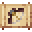 | **Start Smithing and Crafting!** | Use a Schematic. | Task |
|  | **I'm not a bad slime!** | Tame a slime. | Task |
|  | **Bad to be strong sometimes...** | Craft a Dragon Knuckle. | Challenge (hidden) |
| 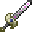 | **Unhealable wound...** | Craft a Spatial Blade. | Goal |
| 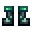 | **Unholy Tourism** | Explore all Hell biomes. | Challenge (hidden) |
|  | **So that's what they do!** | Shoot and kill something with a Unicorn horn from a crossbow. | Goal (hidden) |
|  | **VigilAnt** | Slay a Giant Ant and obtain its Carapace. | Task (hidden) |
|  | **This is Wand-erful!** | Obtain a Magic Staff. | Goal |
| 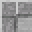 | **It's a way stone?** | Obtain a Warp Pad. | Goal |
|  | **You're A Wizard, Steve** | Use a Magic Tome. | Task |

## Story

| | Advancement | Description | Type |
|---|---|---|---|
|  | **advancements.story.mine_diamond.title** | advancements.story.mine_diamond.description | Task |
|  | **advancements.story.smelt_iron.title** | advancements.story.smelt_iron.description | Task |
