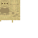

# Birch Tool Rack

<small>[Tensura: Reincarnated](../index.md) &rsaquo; [Blocks](index.md)</small>

| | |
|---|---|
| **ID** | `tensura:birch_tool_rack` |
| **Tool** | Axe |

## Drops

| Item | Count | Chance | Notes |
|---|---|---|---|
|  [Birch Tool Rack](birch-tool-rack.md) | 1 | 100% |  |

## Obtaining

### Recipes

**Crafting (shaped)** &rarr;  [Birch Tool Rack](birch-tool-rack.md)

| | | |
|---|---|---|
|  [Stick](https://minecraft.wiki/w/Stick) |  [Stick](https://minecraft.wiki/w/Stick) |  [Stick](https://minecraft.wiki/w/Stick) |
|  [Birch Fence](https://minecraft.wiki/w/Birch_Fence) |   |  [Birch Fence](https://minecraft.wiki/w/Birch_Fence) |
|  [Birch Slab](https://minecraft.wiki/w/Birch_Slab) |  [Birch Slab](https://minecraft.wiki/w/Birch_Slab) |  [Birch Slab](https://minecraft.wiki/w/Birch_Slab) |

### Loot

| Source | Count | Chance | Notes |
|---|---|---|---|
| Breaking [Birch Tool Rack](birch-tool-rack.md) | 1 | 100% |  |

## Tags

`minecraft:mineable/axe`
