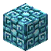

# Chiseled Medium Quality Magic Crystal Bricks

<small>[Tensura: Reincarnated](../index.md) &rsaquo; [Blocks](index.md)</small>

| | |
|---|---|
| **ID** | `tensura:chiseled_medium_quality_magic_crystal_bricks` |
| **Tool** | Pickaxe |
| **Tool tier** | Iron |

## Drops

| Item | Count | Chance | Notes |
|---|---|---|---|
|  [Chiseled Medium Quality Magic Crystal Bricks](chiseled-medium-quality-magic-crystal-bricks.md) | 1 | 100% |  |

## Obtaining

### Recipes

**Stonecutter** &rarr;  [Chiseled Medium Quality Magic Crystal Bricks](chiseled-medium-quality-magic-crystal-bricks.md)

Ingredients:  [Medium Quality Magic Crystal Bricks](medium-quality-magic-crystal-bricks.md)

**Crafting (shaped)** &rarr;  [Chiseled Medium Quality Magic Crystal Bricks](chiseled-medium-quality-magic-crystal-bricks.md)

| |
|---|
|  [Medium Quality Magic Crystal Brick Slab](medium-quality-magic-crystal-brick-slab.md) |
|  [Medium Quality Magic Crystal Brick Slab](medium-quality-magic-crystal-brick-slab.md) |

### Loot

| Source | Count | Chance | Notes |
|---|---|---|---|
| Breaking [Chiseled Medium Quality Magic Crystal Bricks](chiseled-medium-quality-magic-crystal-bricks.md) | 1 | 100% |  |

## Tags

`minecraft:mineable/pickaxe`, `minecraft:needs_iron_tool`
