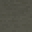

# Dark Labyrinth Stone Stairs

<small>[Tensura: Reincarnated](../index.md) &rsaquo; [Blocks](index.md)</small>

| | |
|---|---|
| **ID** | `tensura:dark_labyrinth_stone_stairs` |

## What it does

Decorative stairs made from [Dark Labyrinth Stone](dark-labyrinth-stone.md).

## Tags

`tensura:labyrinth_blocks`
