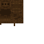

# Dark Oak Tool Rack

<small>[Tensura: Reincarnated](../index.md) &rsaquo; [Blocks](index.md)</small>

| | |
|---|---|
| **ID** | `tensura:dark_oak_tool_rack` |
| **Tool** | Axe |

## Drops

| Item | Count | Chance | Notes |
|---|---|---|---|
|  [Dark Oak Tool Rack](dark-oak-tool-rack.md) | 1 | 100% |  |

## Obtaining

### Recipes

**Crafting (shaped)** &rarr;  [Dark Oak Tool Rack](dark-oak-tool-rack.md)

| | | |
|---|---|---|
|  [Stick](https://minecraft.wiki/w/Stick) |  [Stick](https://minecraft.wiki/w/Stick) |  [Stick](https://minecraft.wiki/w/Stick) |
|  [Dark Oak Fence](https://minecraft.wiki/w/Dark_Oak_Fence) |   |  [Dark Oak Fence](https://minecraft.wiki/w/Dark_Oak_Fence) |
|  [Dark Oak Slab](https://minecraft.wiki/w/Dark_Oak_Slab) |  [Dark Oak Slab](https://minecraft.wiki/w/Dark_Oak_Slab) |  [Dark Oak Slab](https://minecraft.wiki/w/Dark_Oak_Slab) |

### Loot

| Source | Count | Chance | Notes |
|---|---|---|---|
| Breaking [Dark Oak Tool Rack](dark-oak-tool-rack.md) | 1 | 100% |  |

## Tags

`minecraft:mineable/axe`
