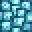

# High Quality Magic Crystal Slab

<small>[Tensura: Reincarnated](../index.md) &rsaquo; [Blocks](index.md)</small>

| | |
|---|---|
| **ID** | `tensura:high_quality_magic_crystal_slab` |
| **Tool** | Pickaxe |
| **Tool tier** | Diamond |

## Drops

| Item | Count | Chance | Notes |
|---|---|---|---|
|  [High Quality Magic Crystal Slab](high-quality-magic-crystal-slab.md) | 2 | 100% |  |

## Obtaining

### Recipes

**Stonecutter** &rarr;  [High Quality Magic Crystal Slab](high-quality-magic-crystal-slab.md) x2

Ingredients:  [High Quality Magic Crystal Block](high-quality-magic-crystal-block.md)

**Crafting (shaped)** &rarr;  [High Quality Magic Crystal Slab](high-quality-magic-crystal-slab.md) x6

| | | |
|---|---|---|
|  [High Quality Magic Crystal Block](high-quality-magic-crystal-block.md) |  [High Quality Magic Crystal Block](high-quality-magic-crystal-block.md) |  [High Quality Magic Crystal Block](high-quality-magic-crystal-block.md) |

### Loot

| Source | Count | Chance | Notes |
|---|---|---|---|
| Breaking [High Quality Magic Crystal Slab](high-quality-magic-crystal-slab.md) | 2 | 100% |  |

## Tags

`minecraft:mineable/pickaxe`, `minecraft:needs_diamond_tool`, `minecraft:slabs`
