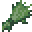

# Hipokute Grass

<small>[Tensura: Reincarnated](../index.md) &rsaquo; [Blocks](index.md)</small>

| | |
|---|---|
| **ID** | `tensura:hipokute_grass` |

## Drops

| Item | Count | Chance | Notes |
|---|---|---|---|
|  [Hipokute Seeds](../items/miscellaneous/hipokute-seeds.md) | 3-5 | 33% | block state property |
|  [Hipokute Seeds](../items/miscellaneous/hipokute-seeds.md) | 1-3 | 33% | block state property |
|  [Hipokute Seeds](../items/miscellaneous/hipokute-seeds.md) | 1 | 33% |  |
|  [Hipokute Grass](hipokute-grass.md) | 1 | 100% | block state property |
|  [Hipokute Flower](../items/miscellaneous/hipokute-flower.md) | 1 | 100% | block state property |

## Obtaining

### Loot

| Source | Count | Chance | Notes |
|---|---|---|---|
| Breaking [Hipokute Grass](hipokute-grass.md) | 1 | 100% | block state property |

## Used in

[High Potion](../items/potions/high-potion.md), [Medium Arcane Potion](../items/potions/medium-arcane-potion.md)

## Tags

`minecraft:crops`
