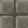

# Labyrinth Brick Warp Pad

<small>[Tensura: Reincarnated](../index.md) &rsaquo; [Blocks](index.md)</small>

| | |
|---|---|
| **ID** | `tensura:labyrinth_brick_warp_pad` |

## Tags

`tensura:warp_pads`
