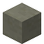

# Labyrinth Stone Top Left

<small>[Tensura: Reincarnated](../index.md) &rsaquo; [Blocks](index.md)</small>

| | |
|---|---|
| **ID** | `tensura:labyrinth_stone_tl` |

## What it does

Building block.

## Tags

`tensura:labyrinth_blocks`
