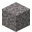

# Loose Gravel

<small>[Tensura: Reincarnated](../index.md) &rsaquo; [Blocks](index.md)</small>

| | |
|---|---|
| **ID** | `tensura:loose_gravel` |
| **Tool** | Shovel |

## Drops

| Item | Count | Chance | Notes |
|---|---|---|---|
|  [Loose Gravel](loose-gravel.md) | 1 | 100% |  |

## Obtaining

### Loot

| Source | Count | Chance | Notes |
|---|---|---|---|
| Breaking [Loose Gravel](loose-gravel.md) | 1 | 100% |  |

## Tags

`minecraft:mineable/shovel`, `tensura:loose_blocks`
