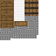

# Mining Station

<small>[Tensura: Reincarnated](../index.md) &rsaquo; [Blocks](index.md)</small>

| | |
|---|---|
| **ID** | `tensura:mining_station` |
| **Tool** | Axe, Pickaxe |

## Drops

| Item | Count | Chance | Notes |
|---|---|---|---|
|  [Mining Station](mining-station.md) | 1 | 100% |  |

## Obtaining

### Recipes

**Crafting (shaped)** &rarr;  [Mining Station](mining-station.md)

| | |
|---|---|
|  [Iron Ingot](https://minecraft.wiki/w/Iron_Ingot) |  [Iron Ingot](https://minecraft.wiki/w/Iron_Ingot) |
|  `#minecraft:stone_crafting_materials` |  `#minecraft:stone_crafting_materials` |
|  `#minecraft:planks` |  `#minecraft:planks` |

### Loot

| Source | Count | Chance | Notes |
|---|---|---|---|
| Breaking [Mining Station](mining-station.md) | 1 | 100% |  |

## Tags

`minecraft:mineable/axe`, `minecraft:mineable/pickaxe`
