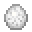

# Moth Egg

<small>[Tensura: Reincarnated](../index.md) &rsaquo; [Blocks](index.md)</small>

| | |
|---|---|
| **ID** | `tensura:moth_egg` |
| **Tool** | Hoe |

## What it does

Hell moth eggs, laid on leaves or wool. They hatch into [Hell Caterpillar](../mobs/hell-caterpillar.md)s over time (mostly at dusk). Walking on them without sneaking tramples them and drops Hell Moth Silk; hell moths and caterpillars can walk on them safely. You can stack up to 4 in one block.

## Drops

| Item | Count | Chance | Notes |
|---|---|---|---|
|  [Moth Egg](moth-egg.md) | 1 | 50% | Needs a specific tool |
|  [Hell-Moth Silk](../items/miscellaneous/hell-moth-silk.md) | 1-3 | 50% |  |

## Obtaining

### Loot

| Source | Count | Chance | Notes |
|---|---|---|---|
| Breaking [Moth Egg](moth-egg.md) | 1 | 50% | Needs a specific tool |

## Tags

`minecraft:mineable/hoe`, `tensura:skill/unobtainable`
