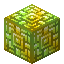

# Block of Orichalcum

<small>[Tensura: Reincarnated](../index.md) &rsaquo; [Blocks](index.md)</small>

| | |
|---|---|
| **ID** | `tensura:orichalcum_block` |
| **Tool** | Pickaxe |
| **Tool tier** | Netherite |

## What it does

Storage block: nine [Orichalcum Ingot](../items/materials/orichalcum-ingot.md) packed into one block. Used to make [Orichalcum Ingot](../items/materials/orichalcum-ingot.md) and [Divine Axe Rhitta](../../tr-nightmares/items/weapons/divine-axe-rhitta.md).

## Drops

| Item | Count | Chance | Notes |
|---|---|---|---|
|  [Block of Orichalcum](orichalcum-block.md) | 1 | 100% |  |

## Obtaining

### Recipes

**Crafting (shaped)** &rarr;  [Block of Orichalcum](orichalcum-block.md)

| | | |
|---|---|---|
|  [Orichalcum Ingot](../items/materials/orichalcum-ingot.md) |  [Orichalcum Ingot](../items/materials/orichalcum-ingot.md) |  [Orichalcum Ingot](../items/materials/orichalcum-ingot.md) |
|  [Orichalcum Ingot](../items/materials/orichalcum-ingot.md) |  [Orichalcum Ingot](../items/materials/orichalcum-ingot.md) |  [Orichalcum Ingot](../items/materials/orichalcum-ingot.md) |
|  [Orichalcum Ingot](../items/materials/orichalcum-ingot.md) |  [Orichalcum Ingot](../items/materials/orichalcum-ingot.md) |  [Orichalcum Ingot](../items/materials/orichalcum-ingot.md) |

**Kiln (mixing)** &rarr;  [Block of Orichalcum](orichalcum-block.md)

Ingredients:  Gold x36,  Magisteel x180

Details: left tensura:gold, right tensura:magisteel

### Loot

| Source | Count | Chance | Notes |
|---|---|---|---|
| Breaking [Block of Orichalcum](orichalcum-block.md) | 1 | 100% |  |

## Used in

[Orichalcum Ingot](../items/materials/orichalcum-ingot.md), [Divine Axe Rhitta](../../tr-nightmares/items/weapons/divine-axe-rhitta.md)

## Tags

`minecraft:beacon_base_blocks`, `minecraft:incorrect_for_diamond_tool`, `minecraft:mineable/pickaxe`, `neoforge:needs_netherite_tool`, `tensura:black_fire_source`, `tensura:boss_immune`
