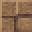

# Packed Mud Warp Pad

<small>[Tensura: Reincarnated](../index.md) &rsaquo; [Blocks](index.md)</small>

| | |
|---|---|
| **ID** | `tensura:packed_mud_warp_pad` |
| **Tool** | Pickaxe |
| **Tool tier** | Iron |

## Drops

| Item | Count | Chance | Notes |
|---|---|---|---|
|  [Packed Mud Warp Pad](packed-mud-warp-pad.md) | 1 | 100% |  |

## Obtaining

### Recipes

**Crafting (shaped)** &rarr;  [Packed Mud Warp Pad](packed-mud-warp-pad.md)

| | | |
|---|---|---|
|  [Packed Mud](https://minecraft.wiki/w/Packed_Mud) |  [Mud Bricks](https://minecraft.wiki/w/Mud_Bricks) |  [Packed Mud](https://minecraft.wiki/w/Packed_Mud) |
|  [Mud Bricks](https://minecraft.wiki/w/Mud_Bricks) |  [Warp Core](../items/materials/warp-core.md) |  [Mud Bricks](https://minecraft.wiki/w/Mud_Bricks) |
|  [Packed Mud](https://minecraft.wiki/w/Packed_Mud) |  [Mud Bricks](https://minecraft.wiki/w/Mud_Bricks) |  [Packed Mud](https://minecraft.wiki/w/Packed_Mud) |

### Loot

| Source | Count | Chance | Notes |
|---|---|---|---|
| Breaking [Packed Mud Warp Pad](packed-mud-warp-pad.md) | 1 | 100% |  |

## Tags

`minecraft:mineable/pickaxe`, `minecraft:needs_iron_tool`, `tensura:warp_pads`
