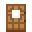

# Palm Door

<small>[Tensura: Reincarnated](../index.md) &rsaquo; [Blocks](index.md)</small>

| | |
|---|---|
| **ID** | `tensura:palm_door` |
| **Tool** | Axe |

## What it does

Decorative door made from [Palm Planks](palm-planks.md).

## Drops

| Item | Count | Chance | Notes |
|---|---|---|---|
|  [Palm Door](palm-door.md) | 1 | 100% | block state property |

## Obtaining

### Recipes

**Crafting (shaped)** &rarr;  [Palm Door](palm-door.md) x3

| | |
|---|---|
|  [Palm Planks](palm-planks.md) |  [Palm Planks](palm-planks.md) |
|  [Palm Planks](palm-planks.md) |  [Palm Planks](palm-planks.md) |
|  [Palm Planks](palm-planks.md) |  [Palm Planks](palm-planks.md) |

### Loot

| Source | Count | Chance | Notes |
|---|---|---|---|
| Breaking [Palm Door](palm-door.md) | 1 | 100% | block state property |

## Tags

`minecraft:mineable/axe`, `minecraft:wooden_doors`
