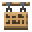

# Palm Hanging Sign

<small>[Tensura: Reincarnated](../index.md) &rsaquo; [Blocks](index.md)</small>

| | |
|---|---|
| **ID** | `tensura:palm_hanging_sign` |
| **Tool** | Axe |

## Drops

| Item | Count | Chance | Notes |
|---|---|---|---|
|  [Palm Hanging Sign](palm-hanging-sign.md) | 1 | 100% |  |

## Obtaining

### Loot

| Source | Count | Chance | Notes |
|---|---|---|---|
| Breaking [Palm Hanging Sign](palm-hanging-sign.md) | 1 | 100% |  |
| Breaking Palm Wall Hanging Sign | 1 | 100% |  |

## Tags

`minecraft:ceiling_hanging_signs`, `minecraft:mineable/axe`
