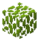

# Palm Leaves

<small>[Tensura: Reincarnated](../index.md) &rsaquo; [Blocks](index.md)</small>

| | |
|---|---|
| **ID** | `tensura:palm_leaves` |
| **Tool** | Hoe |

## What it does

Palm wood. Palm trees grow on **beaches and along rivers**; plant a [Palm Sapling](palm-sapling.md) to grow your own. The wood works like any other (planks, signs, a [Palm Tool Rack](palm-tool-rack.md) and so on).

## Drops

| Item | Count | Chance | Notes |
|---|---|---|---|
|  [Palm Leaves](palm-leaves.md) | 1 | 50% | any of |
|  [Palm Sapling](palm-sapling.md) | 1 | 50% | survives explosion, table bonus |
|  [Stick](https://minecraft.wiki/w/Stick) | 1-2 | 100% | table bonus |

## Obtaining

### Loot

| Source | Count | Chance | Notes |
|---|---|---|---|
| Breaking [Palm Leaves](palm-leaves.md) | 1 | 50% | any of |

## Used in

[Revival Leaves](../../enigmatic-legacy-plus/items/spellstones/revival-leaf.md)

## Tags

`minecraft:leaves`, `minecraft:mineable/hoe`
