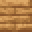

# Palm Pressure Plate

<small>[Tensura: Reincarnated](../index.md) &rsaquo; [Blocks](index.md)</small>

| | |
|---|---|
| **ID** | `tensura:palm_pressure_plate` |
| **Tool** | Axe |

## What it does

Decorative pressure plate made from [Palm Planks](palm-planks.md).

## Drops

| Item | Count | Chance | Notes |
|---|---|---|---|
|  [Palm Pressure Plate](palm-pressure-plate.md) | 1 | 100% |  |

## Obtaining

### Recipes

**Crafting (shaped)** &rarr;  [Palm Pressure Plate](palm-pressure-plate.md)

| | |
|---|---|
|  [Palm Planks](palm-planks.md) |  [Palm Planks](palm-planks.md) |

### Loot

| Source | Count | Chance | Notes |
|---|---|---|---|
| Breaking [Palm Pressure Plate](palm-pressure-plate.md) | 1 | 100% |  |

## Tags

`minecraft:mineable/axe`, `minecraft:wooden_pressure_plates`
