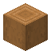
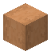

# Palm Slab

<small>[Tensura: Reincarnated](../index.md) &rsaquo; [Blocks](index.md)</small>

| | |
|---|---|
| **ID** | `tensura:palm_slab` |
| **Tool** | Axe |

## Drops

| Item | Count | Chance | Notes |
|---|---|---|---|
|  [Palm Slab](palm-slab.md) | 2 | 100% |  |

## Obtaining

### Recipes

**Woodcutting** &rarr;  [Palm Slab](palm-slab.md) x8

Ingredients:  [Palm Log](palm-log.md)

**Woodcutting** &rarr;  [Palm Slab](palm-slab.md) x2

Ingredients:  [Palm Planks](palm-planks.md)

**Woodcutting** &rarr;  [Palm Slab](palm-slab.md) x8

Ingredients:  [Palm Wood](palm-wood.md)

**Woodcutting** &rarr;  [Palm Slab](palm-slab.md) x8

Ingredients:  [Stripped Palm Log](stripped-palm-log.md)

**Woodcutting** &rarr;  [Palm Slab](palm-slab.md) x8

Ingredients:  [Stripped Palm Wood](stripped-palm-wood.md)

**Crafting (shaped)** &rarr;  [Palm Slab](palm-slab.md) x6

| | | |
|---|---|---|
|  [Palm Planks](palm-planks.md) |  [Palm Planks](palm-planks.md) |  [Palm Planks](palm-planks.md) |

### Loot

| Source | Count | Chance | Notes |
|---|---|---|---|
| Breaking [Palm Slab](palm-slab.md) | 2 | 100% |  |

## Used in

[Palm Tool Rack](palm-tool-rack.md)

## Tags

`minecraft:mineable/axe`, `minecraft:wooden_slabs`
