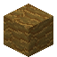
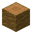

# Palm Wood

<small>[Tensura: Reincarnated](../index.md) &rsaquo; [Blocks](index.md)</small>

| | |
|---|---|
| **ID** | `tensura:palm_wood` |
| **Tool** | Axe |

## What it does

Palm wood. Palm trees grow on **beaches and along rivers**; plant a [Palm Sapling](palm-sapling.md) to grow your own. The wood works like any other (planks, signs, a [Palm Tool Rack](palm-tool-rack.md) and so on).

## Drops

| Item | Count | Chance | Notes |
|---|---|---|---|
|  [Palm Wood](palm-wood.md) | 1 | 100% |  |

## Obtaining

### Recipes

**Crafting (shaped)** &rarr;  [Palm Wood](palm-wood.md) x3

| | |
|---|---|
|  [Palm Log](palm-log.md) |  [Palm Log](palm-log.md) |
|  [Palm Log](palm-log.md) |  [Palm Log](palm-log.md) |

### Loot

| Source | Count | Chance | Notes |
|---|---|---|---|
| Breaking [Palm Wood](palm-wood.md) | 1 | 100% |  |

## Used in

[Bowl](https://minecraft.wiki/w/Bowl), [Ladder](https://minecraft.wiki/w/Ladder), [Palm Button](palm-button.md), [Palm Fence](palm-fence.md), [Palm Planks](palm-planks.md), [Palm Slab](palm-slab.md), [Palm Stairs](palm-stairs.md), [Stick](https://minecraft.wiki/w/Stick)

## Tags

`minecraft:logs`, `minecraft:logs_that_burn`, `minecraft:mineable/axe`
