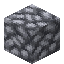

# Block of Raw Silver

<small>[Tensura: Reincarnated](../index.md) &rsaquo; [Blocks](index.md)</small>

| | |
|---|---|
| **ID** | `tensura:raw_silver_block` |
| **Tool** | Pickaxe |
| **Tool tier** | Stone |

## Drops

| Item | Count | Chance | Notes |
|---|---|---|---|
|  [Block of Raw Silver](raw-silver-block.md) | 1 | 100% |  |

## Obtaining

### Recipes

**Crafting (shaped)** &rarr;  [Block of Raw Silver](raw-silver-block.md)

| | | |
|---|---|---|
|  [Raw Silver](../items/miscellaneous/raw-silver.md) |  [Raw Silver](../items/miscellaneous/raw-silver.md) |  [Raw Silver](../items/miscellaneous/raw-silver.md) |
|  [Raw Silver](../items/miscellaneous/raw-silver.md) |  [Raw Silver](../items/miscellaneous/raw-silver.md) |  [Raw Silver](../items/miscellaneous/raw-silver.md) |
|  [Raw Silver](../items/miscellaneous/raw-silver.md) |  [Raw Silver](../items/miscellaneous/raw-silver.md) |  [Raw Silver](../items/miscellaneous/raw-silver.md) |

### Loot

| Source | Count | Chance | Notes |
|---|---|---|---|
| Breaking [Block of Raw Silver](raw-silver-block.md) | 1 | 100% |  |

## Used in

[Raw Silver](../items/miscellaneous/raw-silver.md)

## Tags

`minecraft:mineable/pickaxe`, `minecraft:needs_stone_tool`
