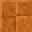

# Red Sandstone Warp Pad

<small>[Tensura: Reincarnated](../index.md) &rsaquo; [Blocks](index.md)</small>

| | |
|---|---|
| **ID** | `tensura:red_sandstone_warp_pad` |
| **Tool** | Pickaxe |
| **Tool tier** | Iron |

## Drops

| Item | Count | Chance | Notes |
|---|---|---|---|
|  [Red Sandstone Warp Pad](red-sandstone-warp-pad.md) | 1 | 100% |  |

## Obtaining

### Recipes

**Crafting (shaped)** &rarr;  [Red Sandstone Warp Pad](red-sandstone-warp-pad.md)

| | | |
|---|---|---|
|  [Smooth Red Sandstone](https://minecraft.wiki/w/Smooth_Red_Sandstone) |  [Cut Red Sandstone](https://minecraft.wiki/w/Cut_Red_Sandstone) |  [Smooth Red Sandstone](https://minecraft.wiki/w/Smooth_Red_Sandstone) |
|  [Cut Red Sandstone](https://minecraft.wiki/w/Cut_Red_Sandstone) |  [Warp Core](../items/materials/warp-core.md) |  [Cut Red Sandstone](https://minecraft.wiki/w/Cut_Red_Sandstone) |
|  [Smooth Red Sandstone](https://minecraft.wiki/w/Smooth_Red_Sandstone) |  [Cut Red Sandstone](https://minecraft.wiki/w/Cut_Red_Sandstone) |  [Smooth Red Sandstone](https://minecraft.wiki/w/Smooth_Red_Sandstone) |

### Loot

| Source | Count | Chance | Notes |
|---|---|---|---|
| Breaking [Red Sandstone Warp Pad](red-sandstone-warp-pad.md) | 1 | 100% |  |

## Tags

`minecraft:mineable/pickaxe`, `minecraft:needs_iron_tool`, `tensura:warp_pads`
