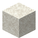

# Sarasa Sand

<small>[Tensura: Reincarnated](../index.md) &rsaquo; [Blocks](index.md)</small>

| | |
|---|---|
| **ID** | `tensura:sarasa_sand` |
| **Tool** | Shovel |

## Drops

| Item | Count | Chance | Notes |
|---|---|---|---|
|  [Sarasa Sand](sarasa-sand.md) | 1 | 100% |  |

## Obtaining

### Recipes

**Crafting (shaped)** &rarr;  [Sarasa Sand](sarasa-sand.md) x4

| | |
|---|---|
|  [Sarasa Sandstone](sarasa-sandstone.md) |  [Sarasa Sandstone](sarasa-sandstone.md) |
|  [Sarasa Sandstone](sarasa-sandstone.md) |  [Sarasa Sandstone](sarasa-sandstone.md) |

### Loot

| Source | Count | Chance | Notes |
|---|---|---|---|
| Breaking [Sarasa Sand](sarasa-sand.md) | 1 | 100% |  |

## Tags

`minecraft:mineable/shovel`, `minecraft:sand`
