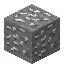

# Silver Ore

<small>[Tensura: Reincarnated](../index.md) &rsaquo; [Blocks](index.md)</small>

| | |
|---|---|
| **ID** | `tensura:silver_ore` |
| **Tool** | Pickaxe |
| **Tool tier** | Stone |

## Drops

| Item | Count | Chance | Notes |
|---|---|---|---|
|  [Silver Ore](silver-ore.md) | 1 | 50% | Needs a specific tool |
|  [Raw Silver](../items/miscellaneous/raw-silver.md) | 1 | 50% |  |

## Obtaining

### Loot

| Source | Count | Chance | Notes |
|---|---|---|---|
| Breaking [Silver Ore](silver-ore.md) | 1 | 50% | Needs a specific tool |

## Used in

[Silver Ingot](../items/materials/silver-ingot.md), [Raw Silver](../items/miscellaneous/raw-silver.md)

## Tags

`c:ore_rates/singular`, `c:ores`, `c:ores_in_ground/stone`, `minecraft:mineable/pickaxe`, `minecraft:needs_stone_tool`, `tensura:ores_stone`, `tensura:silver_ores`, `tensura:skill/ore_skill_breakable`
