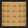
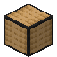

# Single Tatami Carpet

<small>[Tensura: Reincarnated](../index.md) &rsaquo; [Blocks](index.md)</small>

| | |
|---|---|
| **ID** | `tensura:single_tatami_carpet` |
| **Tool** | Hoe |

## What it does

Building block.

## Drops

| Item | Count | Chance | Notes |
|---|---|---|---|
|  [Single Tatami Carpet](single-tatami-carpet.md) | 1 | 100% |  |

## Obtaining

### Recipes

**Crafting (shaped)** &rarr;  [Single Tatami Carpet](single-tatami-carpet.md) x3

| | |
|---|---|
|  [Single Tatami Block](single-tatami-block.md) |  [Single Tatami Block](single-tatami-block.md) |

### Loot

| Source | Count | Chance | Notes |
|---|---|---|---|
| Breaking [Single Tatami Carpet](single-tatami-carpet.md) | 1 | 100% |  |

## Tags

`minecraft:mineable/hoe`
