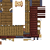

# Smithing Bench

<small>[Tensura: Reincarnated](../index.md) &rsaquo; [Blocks](index.md)</small>

| | |
|---|---|
| **ID** | `tensura:smithing_bench` |
| **Tool** | Axe |
| **Tool tier** | Iron |

## Drops

| Item | Count | Chance | Notes |
|---|---|---|---|
|  [Smithing Bench](smithing-bench.md) | 1 | 100% |  |

## Obtaining

### Recipes

**Crafting (shaped)** &rarr;  [Smithing Bench](smithing-bench.md)

| | |
|---|---|
|  [Paper](https://minecraft.wiki/w/Paper) |  [Paper](https://minecraft.wiki/w/Paper) |
|  [Crafting Table](https://minecraft.wiki/w/Crafting_Table) |  [Smithing Table](https://minecraft.wiki/w/Smithing_Table) |
|  `#minecraft:planks` |  `#minecraft:planks` |

### Loot

| Source | Count | Chance | Notes |
|---|---|---|---|
| Breaking [Smithing Bench](smithing-bench.md) | 1 | 100% |  |

## Tags

`minecraft:mineable/axe`, `minecraft:needs_iron_tool`
