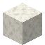

# Smooth Sarasa Sandstone Slab

<small>[Tensura: Reincarnated](../index.md) &rsaquo; [Blocks](index.md)</small>

| | |
|---|---|
| **ID** | `tensura:smooth_sarasa_sandstone_slab` |
| **Tool** | Pickaxe |
| **Tool tier** | Stone |

## What it does

Decorative slab made from [Smooth Sarasa Sandstone](smooth-sarasa-sandstone.md).

## Drops

| Item | Count | Chance | Notes |
|---|---|---|---|
|  [Smooth Sarasa Sandstone Slab](smooth-sarasa-sandstone-slab.md) | 2 | 100% |  |

## Obtaining

### Recipes

**Stonecutter** &rarr;  [Smooth Sarasa Sandstone Slab](smooth-sarasa-sandstone-slab.md) x2

Ingredients:  [Smooth Sarasa Sandstone](smooth-sarasa-sandstone.md)

**Crafting (shaped)** &rarr;  [Smooth Sarasa Sandstone Slab](smooth-sarasa-sandstone-slab.md) x6

| | | |
|---|---|---|
|  [Smooth Sarasa Sandstone](smooth-sarasa-sandstone.md) |  [Smooth Sarasa Sandstone](smooth-sarasa-sandstone.md) |  [Smooth Sarasa Sandstone](smooth-sarasa-sandstone.md) |

### Loot

| Source | Count | Chance | Notes |
|---|---|---|---|
| Breaking [Smooth Sarasa Sandstone Slab](smooth-sarasa-sandstone-slab.md) | 2 | 100% |  |

## Tags

`minecraft:mineable/pickaxe`, `minecraft:needs_stone_tool`, `minecraft:slabs`
