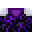

# Spellbinding Table

<small>[Tensura: Reincarnated](../index.md) &rsaquo; [Blocks](index.md)</small>

| | |
|---|---|
| **ID** | `tensura:spellbinding_table` |
| **Tool** | Pickaxe |
| **Tool tier** | Diamond |

## Drops

| Item | Count | Chance | Notes |
|---|---|---|---|
|  [Spellbinding Table](spellbinding-table.md) | 1 | 100% |  |

## Obtaining

### Recipes

**Crafting (shaped)** &rarr;  [Spellbinding Table](spellbinding-table.md)

| | | |
|---|---|---|
|   |  [Magic Stone](../items/materials/magic-stone.md) |   |
|  [Silver Ingot](../items/materials/silver-ingot.md) |  [Crying Obsidian](https://minecraft.wiki/w/Crying_Obsidian) |  [Silver Ingot](../items/materials/silver-ingot.md) |
|  [Crying Obsidian](https://minecraft.wiki/w/Crying_Obsidian) |  [Crying Obsidian](https://minecraft.wiki/w/Crying_Obsidian) |  [Crying Obsidian](https://minecraft.wiki/w/Crying_Obsidian) |

### Loot

| Source | Count | Chance | Notes |
|---|---|---|---|
| Breaking [Spellbinding Table](spellbinding-table.md) | 1 | 100% |  |

## Tags

`minecraft:mineable/pickaxe`, `minecraft:needs_diamond_tool`
