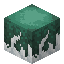

# Spider Egg

<small>[Tensura: Reincarnated](../index.md) &rsaquo; [Blocks](index.md)</small>

| | |
|---|---|
| **ID** | `tensura:spider_egg` |
| **Tool** | Hoe |

## What it does

Black spider eggs, laid by [Black Spider](../mobs/black-spider.md)s. They hatch into baby black spiders over time. Breaking one without **Silk Touch**, blowing it up, landing on it or walking on it without sneaking hatches a hostile spider on the spot and sets off the eggs around it too. Spiders and other arthropods can walk on them safely.

## Drops

| Item | Count | Chance | Notes |
|---|---|---|---|
|  [Spider Egg](spider-egg.md) | 1 | 50% | Needs a specific tool |
|  [Sticky Thread](../items/miscellaneous/sticky-thread.md) | 2-5 | 50% |  |

## Obtaining

### Loot

| Source | Count | Chance | Notes |
|---|---|---|---|
| Chest: Spider Nest (`tensura:chests/spider_nest`) | 1 | 88% |  |
| Breaking [Spider Egg](spider-egg.md) | 1 | 50% | Needs a specific tool |

## Tags

`minecraft:mineable/hoe`, `tensura:web_blocks`
