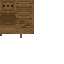

# Spruce Tool Rack

<small>[Tensura: Reincarnated](../index.md) &rsaquo; [Blocks](index.md)</small>

| | |
|---|---|
| **ID** | `tensura:spruce_tool_rack` |
| **Tool** | Axe |

## What it does

A wall rack that holds tools and weapons. Right-click a slot while holding a tool (anything that takes durability) to hang it there, and right-click a filled slot with an empty hand to take it back. Breaking the rack drops whatever was on it. Tool racks are the job site of Tensura's **Guard** profession.

## Drops

| Item | Count | Chance | Notes |
|---|---|---|---|
|  [Spruce Tool Rack](spruce-tool-rack.md) | 1 | 100% |  |

## Obtaining

### Recipes

**Crafting (shaped)** &rarr;  [Spruce Tool Rack](spruce-tool-rack.md)

| | | |
|---|---|---|
|  [Stick](https://minecraft.wiki/w/Stick) |  [Stick](https://minecraft.wiki/w/Stick) |  [Stick](https://minecraft.wiki/w/Stick) |
|  [Spruce Fence](https://minecraft.wiki/w/Spruce_Fence) |   |  [Spruce Fence](https://minecraft.wiki/w/Spruce_Fence) |
|  [Spruce Slab](https://minecraft.wiki/w/Spruce_Slab) |  [Spruce Slab](https://minecraft.wiki/w/Spruce_Slab) |  [Spruce Slab](https://minecraft.wiki/w/Spruce_Slab) |

### Loot

| Source | Count | Chance | Notes |
|---|---|---|---|
| Breaking [Spruce Tool Rack](spruce-tool-rack.md) | 1 | 100% |  |

## Tags

`minecraft:mineable/axe`
