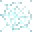

# Sticky Cobweb

<small>[Tensura: Reincarnated](../index.md) &rsaquo; [Blocks](index.md)</small>

| | |
|---|---|
| **ID** | `tensura:sticky_cobweb` |

## What it does

Web left by a [Sticky Web Cartridge](../items/miscellaneous/sticky-web-cartridge.md). It traps anything inside almost completely and dissolves on its own after a few seconds.

## Obtaining

### Loot

| Source | Count | Chance | Notes |
|---|---|---|---|
| Chest: Spider Nest (`tensura:chests/spider_nest`) | 1 | 88% |  |

## Tags

`tensura:skill/trap_blocks`, `tensura:web_blocks`
