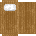

# Thatch Bed

<small>[Tensura: Reincarnated](../index.md) &rsaquo; [Blocks](index.md)</small>

| | |
|---|---|
| **ID** | `tensura:thatch_bed` |

## What it does

A low straw bed. It works like a normal bed (sleep, set your spawn), and landing on it takes 25% off fall damage without bouncing you.

## Drops

| Item | Count | Chance | Notes |
|---|---|---|---|
|  [Thatch Bed](thatch-bed.md) | 1 | 100% |  |

## Obtaining

### Recipes

**Crafting (shaped)** &rarr;  [Thatch Bed](thatch-bed.md)

| | | |
|---|---|---|
|   |   |   |
|   |   |  [Thatch](../items/miscellaneous/thatch.md) |
|  [Thatch Block](thatch-block.md) |  [Thatch Block](thatch-block.md) |  [Thatch Block](thatch-block.md) |

### Loot

| Source | Count | Chance | Notes |
|---|---|---|---|
| Breaking [Thatch Bed](thatch-bed.md) | 1 | 100% |  |

## Tags

`minecraft:beds`
