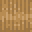

# Thatch Stairs

<small>[Tensura: Reincarnated](../index.md) &rsaquo; [Blocks](index.md)</small>

| | |
|---|---|
| **ID** | `tensura:thatch_stairs` |
| **Tool** | Hoe, Sickle |

## Drops

| Item | Count | Chance | Notes |
|---|---|---|---|
|  [Thatch Stairs](thatch-stairs.md) | 1 | 100% |  |

## Obtaining

### Recipes

**Crafting (shaped)** &rarr;  [Thatch Stairs](thatch-stairs.md) x4

| | | |
|---|---|---|
|  [Thatch Block](thatch-block.md) |   |   |
|  [Thatch Block](thatch-block.md) |  [Thatch Block](thatch-block.md) |   |
|  [Thatch Block](thatch-block.md) |  [Thatch Block](thatch-block.md) |  [Thatch Block](thatch-block.md) |

### Loot

| Source | Count | Chance | Notes |
|---|---|---|---|
| Breaking [Thatch Stairs](thatch-stairs.md) | 1 | 100% |  |

## Tags

`minecraft:mineable/hoe`, `minecraft:mineable/sickle`
