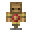

# Training Dummy

<small>[Tensura: Reincarnated](../index.md) &rsaquo; [Blocks](index.md)</small>

| | |
|---|---|
| **ID** | `tensura:training_dummy` |

## What it does

A straw training dummy (two blocks tall). You can hit it as much as you like: after each hit it shows the total damage dealt in your action bar. It's the job site of Tensura's **Battlewill Trainer** profession.

## Drops

| Item | Count | Chance | Notes |
|---|---|---|---|
|  [Training Dummy](training-dummy.md) | 1 | 100% |  |

## Obtaining

### Recipes

**Crafting (shaped)** &rarr;  [Training Dummy](training-dummy.md)

| | | |
|---|---|---|
|  [Thatch](../items/miscellaneous/thatch.md) |  [Thatch Block](thatch-block.md) |  [Thatch](../items/miscellaneous/thatch.md) |
|  [Thatch](../items/miscellaneous/thatch.md) |  `#minecraft:wooden_fences` |  [Thatch](../items/miscellaneous/thatch.md) |
|   |  [Smooth Stone Slab](https://minecraft.wiki/w/Smooth_Stone_Slab) |   |

### Loot

| Source | Count | Chance | Notes |
|---|---|---|---|
| Breaking [Training Dummy](training-dummy.md) | 1 | 100% |  |
