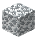

# Web Slab

<small>[Tensura: Reincarnated](../index.md) &rsaquo; [Blocks](index.md)</small>

| | |
|---|---|
| **ID** | `tensura:web_slab` |

## What it does

Decorative slab made from [Web Block](web-block.md).

## Drops

| Item | Count | Chance | Notes |
|---|---|---|---|
|  [Web Slab](web-slab.md) | 2 | 100% |  |

## Obtaining

### Recipes

**Crafting (shaped)** &rarr;  [Web Slab](web-slab.md) x6

| | | |
|---|---|---|
|  [Web Block](web-block.md) |  [Web Block](web-block.md) |  [Web Block](web-block.md) |

### Loot

| Source | Count | Chance | Notes |
|---|---|---|---|
| Breaking [Web Slab](web-slab.md) | 2 | 100% |  |

## Tags

`tensura:web_blocks`
