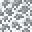

# Web Stairs

<small>[Tensura: Reincarnated](../index.md) &rsaquo; [Blocks](index.md)</small>

| | |
|---|---|
| **ID** | `tensura:web_stairs` |

## What it does

Decorative stairs made from [Web Block](web-block.md).

## Drops

| Item | Count | Chance | Notes |
|---|---|---|---|
|  [Web Stairs](web-stairs.md) | 1 | 100% |  |

## Obtaining

### Recipes

**Crafting (shaped)** &rarr;  [Web Stairs](web-stairs.md) x4

| | | |
|---|---|---|
|  [Web Block](web-block.md) |   |   |
|  [Web Block](web-block.md) |  [Web Block](web-block.md) |   |
|  [Web Block](web-block.md) |  [Web Block](web-block.md) |  [Web Block](web-block.md) |

### Loot

| Source | Count | Chance | Notes |
|---|---|---|---|
| Breaking [Web Stairs](web-stairs.md) | 1 | 100% |  |

## Tags

`tensura:web_blocks`
