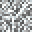

# Webbed Cobblestone Wall

<small>[Tensura: Reincarnated](../index.md) &rsaquo; [Blocks](index.md)</small>

| | |
|---|---|
| **ID** | `tensura:webbed_cobblestone_wall` |
| **Tool** | Pickaxe |

## Drops

| Item | Count | Chance | Notes |
|---|---|---|---|
|  [Webbed Cobblestone Wall](webbed-cobblestone-wall.md) | 1 | 100% |  |

## Obtaining

### Recipes

**Stonecutter** &rarr;  [Webbed Cobblestone Wall](webbed-cobblestone-wall.md)

Ingredients:  [Webbed Cobblestone](webbed-cobblestone.md)

**Crafting (shaped)** &rarr;  [Webbed Cobblestone Wall](webbed-cobblestone-wall.md) x6

| | | |
|---|---|---|
|  [Webbed Cobblestone](webbed-cobblestone.md) |  [Webbed Cobblestone](webbed-cobblestone.md) |  [Webbed Cobblestone](webbed-cobblestone.md) |
|  [Webbed Cobblestone](webbed-cobblestone.md) |  [Webbed Cobblestone](webbed-cobblestone.md) |  [Webbed Cobblestone](webbed-cobblestone.md) |

### Loot

| Source | Count | Chance | Notes |
|---|---|---|---|
| Breaking [Webbed Cobblestone Wall](webbed-cobblestone-wall.md) | 1 | 100% |  |

## Tags

`minecraft:mineable/pickaxe`, `minecraft:walls`, `tensura:web_blocks`
