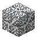
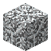

# Webbed Stone Bricks

<small>[Tensura: Reincarnated](../index.md) &rsaquo; [Blocks](index.md)</small>

| | |
|---|---|
| **ID** | `tensura:webbed_stone_bricks` |
| **Tool** | Pickaxe |

## What it does

Stone overgrown with web. Walking on it slows you a little (to 80%) and cuts your jump. Web bullets turn stone into webbed cobblestone.

## Drops

| Item | Count | Chance | Notes |
|---|---|---|---|
|  [Webbed Stone Bricks](webbed-stone-bricks.md) | 1 | 100% |  |

## Obtaining

### Recipes

**Stonecutter** &rarr;  [Webbed Stone Bricks](webbed-stone-bricks.md)

Ingredients:  [Webbed Cobblestone](webbed-cobblestone.md)

### Loot

| Source | Count | Chance | Notes |
|---|---|---|---|
| Breaking [Webbed Stone Bricks](webbed-stone-bricks.md) | 1 | 100% |  |

## Used in

[Webbed Stone Brick Wall](webbed-stone-brick-wall.md), [Webbed Stone Brick Slab](webbed-stone-brick-slab.md), [Webbed Stone Brick Stairs](webbed-stone-brick-stairs.md), [Webbed Cobblestone](webbed-cobblestone.md)

## Tags

`minecraft:mineable/pickaxe`, `tensura:web_blocks`
