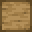

# Woodcutter

<small>[Tensura: Reincarnated](../index.md) &rsaquo; [Blocks](index.md)</small>

| | |
|---|---|
| **ID** | `tensura:woodcutter` |
| **Tool** | Axe |

## Drops

| Item | Count | Chance | Notes |
|---|---|---|---|
|  [Woodcutter](woodcutter.md) | 1 | 100% |  |

## Obtaining

### Recipes

**Crafting (shaped)** &rarr;  [Woodcutter](woodcutter.md)

| | | |
|---|---|---|
|   |  [Iron Ingot](https://minecraft.wiki/w/Iron_Ingot) |   |
|  `#minecraft:planks` |  `#minecraft:planks` |  `#minecraft:planks` |

### Loot

| Source | Count | Chance | Notes |
|---|---|---|---|
| Breaking [Woodcutter](woodcutter.md) | 1 | 100% |  |

## Tags

`minecraft:mineable/axe`
