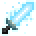

# Aura Sword

<small>[Tensura: Reincarnated](../index.md) &rsaquo; [Effects](index.md)</small>

| | |
|---|---|
| **ID** | `tensura:aura_sword` |
| **Type** | Beneficial |

## What it does

Aura Sword (battlewill). Each physical hit you make adds your **weapon damage** again as a bonus (×1), and your weapon hits count as **battlewill damage**, which some ki and chi releases need. It lasts 60 seconds from a press, or stays up while the art is toggled on.

## Applied by

[Aura Sword](../abilities/battlewill/aura-sword.md), [Dark Magic Release](../../tr-nightmares/abilities/intrinsic-skills/dark-magic-release.md), [Holy Magic Release](../../tr-nightmares/abilities/intrinsic-skills/holy-magic-release.md), [Steel Ki Release](../../tr-nightmares/abilities/intrinsic-skills/steel-ki-release.md), [Poison Ki Release](../../tr-nightmares/abilities/intrinsic-skills/poison-ki-release.md), [Fire Ki Release](../../tr-nightmares/abilities/intrinsic-skills/fire-ki-release.md), [Water Ki Release](../../tr-nightmares/abilities/intrinsic-skills/water-ki-release.md), [Saint Chi](../../tr-nightmares/abilities/intrinsic-skills/saint-chi.md), [Dark Chi](../../tr-nightmares/abilities/intrinsic-skills/dark-chi.md), [Phainon, The Deliverer](../../tensura-more-skills/abilities/ultimate-skills/phainon.md), [Avalon, God of the Eternal Kingdom](../../tensura-more-skills/abilities/ultimate-skills/avalon-god-of-eternal-kingdom.md)
