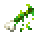

# Corrosion

<small>[Tensura: Reincarnated](../index.md) &rsaquo; [Effects](index.md)</small>

| | |
|---|---|
| **ID** | `tensura:corrosion` |
| **Type** | Harmful |

## What it does

Acid. Every second it deals **2** damage per level, which can't be dodged, and wears down **every equipped item** by 15 durability per level.

Corrosion Nullification makes you immune (it also blocks Wither), and so does being an Orc Disaster. Reverser turns it into Regeneration II. Acid Shell, Curse Bind, Starved, Corrosion, orc lords' hits and several gluttony skills inflict it. Potions of Corrosion exist.

## Applied by

[Curse Bind](../abilities/spiritual-magic/curse-bind.md), [Acid Shell](../abilities/aspectual-magic/acid-shell.md), [Gluttony](../abilities/unique-skills/gluttony.md), [Gourmet](../abilities/unique-skills/gourmet.md), [Reverser](../abilities/unique-skills/reverser.md), [Starved](../abilities/unique-skills/starved.md), [Corrosion Nullification](../abilities/resistance-skills/corrosion-nullification.md), [Corrosion](../abilities/common-skills/corrosion.md), [Snake Eye](../abilities/extra-skills/snake-eye.md), [Dragon Factor Haki](../../tr-nightmares/abilities/intrinsic-skills/dragon-factor-haki.md), [Death God](../../tr-nightmares/abilities/ultimate-skills/death-god.md), [｢ Beelzebuth, Lord of Gluttony ｣](../../tr-nightmares/abilities/ultimate-skills/beelzebuth.md), [｢ Beelzebub, Lord of Gourmet ｣](../../tr-nightmares/abilities/ultimate-skills/beelzebub.md), [Gluttony Manas](../../tr-nightmares/abilities/ultimate-skills/gluttony-manas.md), [Caedros, God of Conquest](../../tensura-more-skills/abilities/ultimate-skills/caedros-god-of-conquest.md), [Corrosion Transform](../../tensura-mysticism/abilities/intrinsic-skills/corrosion-transform.md), [Corroder](../../tensura-mysticism/abilities/unique-skills/corroder.md)
