# Effects

<small>[Tensura: Reincarnated](../index.md)</small>

Status effects added by Tensura: Reincarnated.

| | Effect | Type | Description |
|---|---|---|---|
| 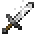 | [Ally Boost](ally-boost.md) | Beneficial |  |
|  | [Anti-Magic](anti-magic.md) | Harmful |  |
| 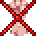 | [Anti-Shock](anti-shock.md) | Neutral |  |
|  | [Anti-Skill](anti-skill.md) | Harmful |  |
|  | [Auditory Sense](auditory-sense.md) | Beneficial |  |
| 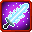 | [Aura Sword](aura-sword.md) | Beneficial |  |
|  | [Bats Mode](bats-mode.md) | Beneficial |  |
|  | [Beast Transformation](beast-transformation.md) | Beneficial |  |
| 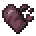 | [Black Burn](black-burn.md) | Harmful |  |
|  | [Burden](burden.md) | Harmful |  |
|  | [Chill](chill.md) | Harmful |  |
| 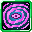 | [Confusion](confusion.md) | Harmful |  |
|  | [Corrosion](corrosion.md) | Harmful |  |
|  | [Curse](curse.md) | Harmful |  |
| 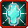 | [Diamond Path](diamond-path.md) | Beneficial |  |
|  | [Disintegrating](disintegrating.md) | Harmful |  |
|  | [Dragon Mode](dragon-mode.md) | Beneficial |  |
|  | [Drowsiness](drowsiness.md) | Harmful |  |
|  | [Earth Lock](earth-lock.md) | Beneficial |  |
|  | [Enemy Search](enemy-search.md) | Beneficial |  |
| 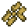 | [Energy Blockade](energy-blockade.md) | Harmful |  |
|  | [Engorgement](engorgement.md) | Beneficial |  |
|  | [Falsifier](falsifier.md) | Beneficial |  |
| 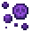 | [Fatal Poison](fatal-poison.md) | Harmful |  |
|  | [Fate Change](fate-change.md) | Beneficial |  |
|  | [Fear](fear.md) | Harmful |  |
|  | [Flashed Blindness](flashed-blindness.md) | Harmful |  |
|  | [Fragility](fragility.md) | Harmful |  |
|  | [Frost](frost.md) | Harmful |  |
|  | [Future Vision](future-vision.md) | Beneficial |  |
|  | [Guarded](guarded.md) | Beneficial |  |
|  | [Haki Coat](haki-coat.md) | Beneficial |  |
|  | [Healthcare](healthcare.md) | Beneficial |  |
|  | [Holy Damage](holy-damage.md) | Neutral |  |
|  | [Hypnosis](hypnosis.md) | Harmful |  |
|  | [Illusion Boost](illusion-boost.md) | Beneficial |  |
| 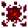 | [Infection](infection.md) | Harmful |  |
|  | [Infinite Imprisonment](infinite-imprisonment.md) | Harmful |  |
| 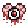 | [Insanity](insanity.md) | Harmful |  |
|  | [Inspiration](inspiration.md) | Beneficial |  |
| 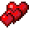 | [Instant Regeneration](instant-regeneration.md) | Beneficial |  |
|  | [Lust Drain](lust-drain.md) | Beneficial |  |
|  | [Lust Embracement](lust-embracement.md) | Neutral |  |
|  | [Mad Ogre](mad-ogre.md) | Beneficial |  |
|  | [Magic Aura](magic-aura.md) | Beneficial |  |
|  | [Magic Barrier](magic-barrier.md) | Beneficial |  |
|  | [Magic Elemental Transformation](magic-elemental-transformation.md) | Beneficial |  |
| 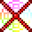 | [Magic Interference](magic-interference.md) | Harmful |  |
|  | [Magicule Poison](magicule-poison.md) | Neutral |  |
|  | [Magicule Regeneration](magicule-regeneration.md) | Beneficial |  |
|  | [Mind Control](mind-control.md) | Harmful |  |
| 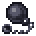 | [Movement Interference](movement-interference.md) | Harmful |  |
| 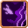 | [Ogre Berserker](ogre-berserker.md) | Neutral |  |
| 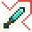 | [Ogre Guillotine](ogre-guillotine.md) | Beneficial |  |
|  | [Oppression](oppression.md) | Harmful |  |
|  | [Paralysis](paralysis.md) | Harmful |  |
| 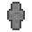 | [Petrification](petrification.md) | Harmful |  |
|  | [Physical Barrier](physical-barrier.md) | Beneficial |  |
| 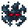 | [Presence Concealment](presence-concealment.md) | Beneficial |  |
|  | [Presence Sense](presence-sense.md) | Beneficial |  |
|  | [Protection](protection.md) | Beneficial |  |
|  | [Rampage](rampage.md) | Neutral |  |
|  | [Reinforcement](reinforcement.md) | Beneficial |  |
| 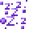 | [Rest](rest.md) | Beneficial |  |
|  | [Self-Regeneration](self-regeneration.md) | Beneficial |  |
| 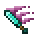 | [Severance Blade](severance-blade.md) | Beneficial |  |
| 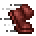 | [Shadow Step](shadow-step.md) | Beneficial |  |
|  | [Silence](silence.md) | Harmful |  |
|  | [Sleep](sleep.md) | Harmful |  |
| 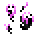 | [Soul Drain](soul-drain.md) | Harmful |  |
|  | [Spatial Blockade](spatial-blockade.md) | Harmful |  |
|  | [Spearhead](spearhead.md) | Beneficial |  |
| 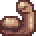 | [Strengthen](strengthen.md) | Beneficial |  |
|  | [True Blindness](true-blindness.md) | Harmful |  |
|  | [Warping](warping.md) | Neutral |  |
|  | [Webbed](webbed.md) | Harmful |  |
|  | [Wind's Protection](wind-protection.md) | Beneficial |  |
