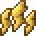

# Paralysis

<small>[Tensura: Reincarnated](../index.md) &rsaquo; [Effects](index.md)</small>

| | |
|---|---|
| **ID** | `tensura:paralysis` |
| **Type** | Harmful |

## Applied by

[Curse Bind](../abilities/spiritual-magic/curse-bind.md), [Sleep Mist](../abilities/aspectual-magic/sleep-mist.md), [Reverser](../abilities/unique-skills/reverser.md), [Survivor](../abilities/unique-skills/survivor.md), [Wind Transform](../abilities/intrinsic-skills/wind-transform.md), [Paralysis Resistance](../abilities/resistance-skills/paralysis-resistance.md), [Abnormal Condition Nullification](../abilities/resistance-skills/abnormal-condition-nullification.md), [Paralysis Nullification](../abilities/resistance-skills/paralysis-nullification.md), [Paralysis](../abilities/common-skills/paralysis.md), [Snake Eye](../abilities/extra-skills/snake-eye.md), [Arelkos](../../tr-nightmares/abilities/unique-skills/arelkos.md), [Dragon Factor Haki](../../tr-nightmares/abilities/intrinsic-skills/dragon-factor-haki.md), [｢ Leviathan, Lord of Envy ｣](../../tr-nightmares/abilities/ultimate-skills/leviathan.md), [｢ Mammon, Lord of Greed ｣](../../tr-nightmares/abilities/ultimate-skills/mammon.md), [Fungus Infection](../../tensura-more-skills/abilities/unique-skills/fungus-infection.md), [Caedros, God of Conquest](../../tensura-more-skills/abilities/ultimate-skills/caedros-god-of-conquest.md), [Paralysis Transform](../../tensura-mysticism/abilities/intrinsic-skills/paralysis-transform.md), [Captivator](../../tensura-mysticism/abilities/unique-skills/captivator.md), [Deus Sanguis](../../ascension/abilities/unique-skills/deus-sanguis.md), [Trash Gamer](../../ascension/abilities/unique-skills/trash-gamer.md)
