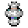

# Webbed

<small>[Tensura: Reincarnated](../index.md) &rsaquo; [Effects](index.md)</small>

| | |
|---|---|
| **ID** | `tensura:webbed` |
| **Type** | Harmful |

## What it does

Stuck in webbing. Your movement and swim speed drop by **99%**, jumping, reach and follow range are cut (by 50%, 50% and 80%), you can't jump, and your view is locked in place. **Catching fire burns the web away** instantly (and any [Silence](silence.md) with it). Web bullets, thrown cobwebs, black spiders and hell caterpillars inflict it.

## Attribute changes (per level)

| Attribute | Amount | Operation |
|---|---|---|
| Swim Speed Multiplier | -0.99 | multiply total |
| Movement Speed | -0.99 | multiply total |
| Jump Strength | -0.5 | multiply total |
| Entity Interaction Range | -0.5 | multiply total |
| Block Interaction Range | -0.5 | multiply total |
| Follow Range | -0.8 | multiply total |

## Applied by

[Stick Steel Thread](../abilities/extra-skills/sticky-steel-thread.md), [Naberius](../../tensura-more-skills/abilities/ultimate-skills/naberius.md), [Caedros, God of Conquest](../../tensura-more-skills/abilities/ultimate-skills/caedros-god-of-conquest.md)
