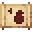

# Ant Carapace Boots

<small>[Tensura: Reincarnated](../../index.md) &rsaquo; [Items](../index.md) &rsaquo; [Armor](index.md)</small>

| | |
|---|---|
| **ID** | `tensura:ant_carapace_boots` |
| **Category** | Armor |
| **Gear EP** | 3,000 - None |

## Obtaining

### Recipes

**Smithing Bench** &rarr;  [Ant Carapace Boots](ant-carapace-boots.md)

Ingredients:  [Giant Ant Carapace](../miscellaneous/giant-ant-carapace.md) x4,  [Gold Ingot](https://minecraft.wiki/w/Gold_Ingot)

Requires schematic:  [Ant Carapace Gear Schematic](../schematics/ant-carapace-gear-schematic.md)

## Tags

`minecraft:foot_armor`
