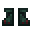

# Armorsaurus Boots

<small>[Tensura: Reincarnated](../../index.md) &rsaquo; [Items](../index.md) &rsaquo; [Armor](index.md)</small>

| | |
|---|---|
| **ID** | `tensura:armorsaurus_boots` |
| **Category** | Armor |
| **Gear EP** | 6,000 - None |

## Tags

`minecraft:foot_armor`, `tensura:body_armor_items`
